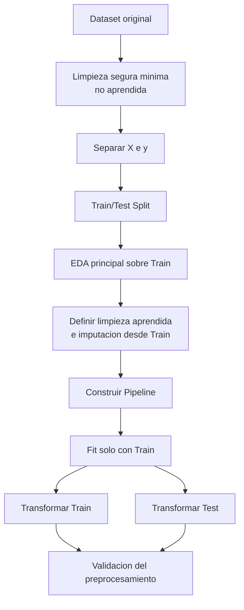

# Auditoria y Orden del Proyecto

## Resumen

Este documento deja ordenado:

- que valor real tiene el notebook ya presentado,
- que criterio metodologico vamos a seguir,
- que archivo queda obsoleto,
- y cual sera el checklist general por etapas antes de construir el flujo detallado.

## 1. Punto de partida real

Notebook base revisado:

- `Evaluación_2__PREPROCESAMIENTO_DE_DATOS.ipynb`

Dataset confirmado para el proyecto:

- `data/raw/bank-additional-full.csv`
- `41.188` filas
- `21` columnas
- variable objetivo `y`
- distribucion de `y`: `36.548 no` y `4.640 yes`

Ese notebook **si tiene base util**, pero esta mezclado. Contiene:

- carga del dataset,
- revision de estructura y tipos,
- deteccion de `unknown`,
- conversion de parte de esos valores a `NaN`,
- eliminacion de `duration` por `data leakage`,
- varias visualizaciones,
- parte de codificacion y escalamiento.

Problema principal:

- funciona como una mezcla de EDA, limpieza, transformacion y preparacion para modelado,
- pero no deja claramente separado el flujo correcto exigido por el acta.

## 2. Criterio metodologico que vamos a usar

La decision correcta es esta:

**si, hay que separar las etapas del notebook y hacer `train_test_split` antes de cualquier transformacion que aprenda parametros.**

Eso implica:

- se puede hacer una inspeccion minima inicial para entender columnas y estructura,
- pero el split formal debe ocurrir al inicio del trabajo real,
- desde ese punto, todo lo que aprenda algo del dato debe ajustarse solo con `Train`.

Ejemplos de cosas que deben aprender solo desde `Train`:

- imputacion,
- tratamiento basado en frecuencias o medianas,
- escalamiento,
- codificacion,
- deteccion de outliers basada en umbrales aprendidos,
- ingenieria de caracteristicas si depende de estadisticas del dataset.

Secuencia metodologica correcta:

1. cargar el dataset,
2. hacer limpieza segura minima no aprendida,
3. separar `X` e `y`,
4. ejecutar `train_test_split`,
5. hacer el EDA principal sobre `Train`,
6. decidir limpieza aprendida y transformaciones usando solo `Train`,
7. construir la pipeline,
8. hacer `fit` de la pipeline sobre `Train`,
9. aplicar `transform` a `Train` y `Test`,
10. validar resultados y continuar con modelado si corresponde.

Ejemplos de limpieza segura minima no aprendida:

- revisar separador y tipos de lectura,
- normalizar nombres si hiciera falta,
- convertir `unknown` a `NaN` si esa sera la convencion del proyecto,
- eliminar `duration` si se confirma su descarte por criterio de leakage.

## 2.1 Diagrama metodologico base

## 3. Archivos actuales y como tratarlos

### Utiles

- `Evaluación_2__PREPROCESAMIENTO_DE_DATOS.ipynb`
- `data/raw/bank-additional-full.csv`
- `docs/md-fuente/Acta de proyecto preprocesamiento.md`
- `docs/md-fuente/EVALUACIÓN PARCIAL 4_ESTUDIANTE.md`
- `notebooks/structure.ipynb`
- `notebooks/preprocessing.py`

### Obsoleto

- `PLAN_TRABAJO_ROL_B.md`

Motivo:

- es antiguo,
- responde a una organizacion por rol,
- hoy nos mete ruido porque necesitamos ordenar el proyecto completo por etapas.

### De apoyo, pero no centrales

- `README.md`
- `docs/md-fuente/Bank Marketing Dataset.md`

## 4. Que concluimos sobre el notebook ya presentado

La conclusion correcta no es desecharlo, sino **desarmarlo y reutilizarlo con orden**.

Lo que si rescataremos:

- justificacion de `duration` como leakage,
- deteccion de `unknown`,
- parte del relato de negocio,
- graficos que sigan siendo utiles,
- decisiones que tengan sentido metodologico.

Lo que no debemos mantener tal cual:

- analisis y transformaciones mezcladas en un mismo bloque,
- decisiones tomadas sobre el dataset completo cuando deberian depender de `Train`,
- transicion directa desde EDA a preprocesamiento sin separar etapas.

## 5. Checklist general por etapas

### Etapa 0. Orden documental

- [x] Trabajar los nuevos `.md` solo dentro de `docs/md-fuente/`
- [ ] Marcar `PLAN_TRABAJO_ROL_B.md` como referencia obsoleta
- [ ] Elegir un notebook principal de trabajo
- [ ] Definir que archivos actuales se reutilizan y cuales solo quedan como antecedente

### Etapa 1. Consolidacion base del proyecto

- [x] Confirmar el dataset exacto que usaremos
- [x] Confirmar la estructura minima del proyecto
- [x] Dejar claro cual sera el entregable principal
- [x] Separar antecedente presentado vs. flujo final del proyecto

Resultado de la Etapa 1:

- dataset oficial: `data/raw/bank-additional-full.csv`
- notebook anterior: antecedente util, no entregable final
- notebook maestro definido para el flujo nuevo: `notebooks/01_preprocesamiento_proyecto.ipynb`
- estructura base definida:
  - `data/raw/`
  - `data/splits/`
  - `data/processed/`
  - `notebooks/`
  - `reports/figures/`
  - `reports/presentacion/`
  - `docs/md-fuente/`

### Etapa 2. Split metodologico correcto

- [ ] Cargar el dataset
- [ ] Separar `X` e `y`
- [ ] Ejecutar `train_test_split(..., stratify=y, random_state=42)`
- [ ] Reservar `X_test` y `y_test` para no contaminarlos
- [ ] Documentar por que este paso ocurre antes del resto

### Etapa 3. Comprension y limpieza sobre Train

- [ ] Revisar tipos de datos en `X_train`
- [ ] Revisar `unknown` y nulos en `X_train`
- [ ] Revisar duplicados
- [ ] Revisar posibles outliers
- [ ] Definir que se elimina, que se imputa y que se conserva
- [ ] Documentar cada decision con criterio tecnico

### Etapa 4. EDA ordenado

- [ ] Separar EDA univariado
- [ ] Separar EDA bivariado con la variable objetivo
- [ ] Elegir graficos realmente utiles
- [ ] Evitar repetir graficos sin valor para la presentacion
- [ ] Consolidar al menos 15 graficos defendibles

### Etapa 5. Preprocesamiento tecnico

- [ ] Definir columnas numericas
- [ ] Definir columnas categoricas nominales
- [ ] Definir columnas categoricas ordinales
- [ ] Corregir inconsistencias entre notebook y script
- [ ] Aplicar imputacion si corresponde
- [ ] Escalar variables numericas
- [ ] Codificar variables categoricas

### Etapa 6. Pipeline reproducible

- [ ] Construir `Pipeline` y `ColumnTransformer`
- [ ] Verificar que todo `fit` ocurra solo en `Train`
- [ ] Aplicar `transform` a `Train` y `Test`
- [ ] Validar ausencia de `NaN`
- [ ] Validar consistencia dimensional entre `Train` y `Test`

### Etapa 7. Ingenieria de caracteristicas

- [ ] Definir nuevas variables justificadas
- [ ] Validar que sus reglas salgan desde `Train`
- [ ] Integrarlas al flujo sin romper el pipeline
- [ ] Medir si realmente agregan valor al proyecto

### Etapa 8. Cierre del entregable

- [ ] Dejar conclusiones tecnicas claras
- [ ] Seleccionar los graficos finales
- [ ] Ordenar el relato del notebook final
- [ ] Limpiar referencias innecesarias y archivos que solo agregan ruido

## 6. Orden conceptual correcto del proyecto

El orden correcto no es:

- cargar,
- explorar todo,
- transformar todo,
- y despues separar train/test.

El orden correcto es:

1. cargar,
2. hacer limpieza segura minima,
3. separar `X` e `y`,
4. hacer split,
5. desarrollar EDA sobre `Train`,
6. decidir limpieza aprendida y transformaciones desde `Train`,
7. aplicar el mismo criterio a `Test` mediante la pipeline ya ajustada,
8. consolidar el dataset final y la narrativa del proyecto.

## 7. Decision practica para seguir

Nuestra base de trabajo sera esta:

- el notebook presentado queda como antecedente util,
- no como flujo final definitivo,
- el proyecto se va a reorganizar por etapas,
- y el siguiente paso debe ser ordenar la estructura y decidir cual sera el notebook maestro.
