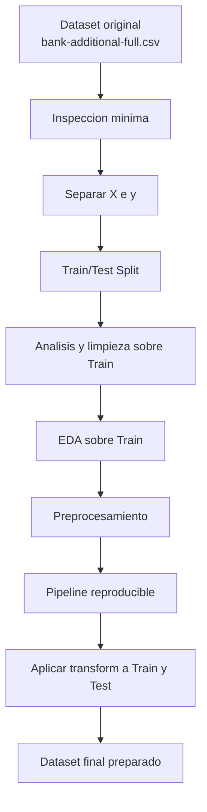
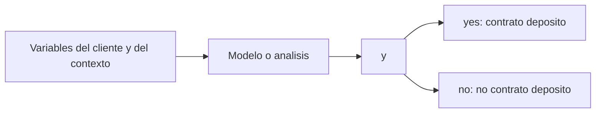

# Marco Teorico y Explicativo del Proyecto

## 1. Que estamos haciendo

Estamos preparando un proyecto de preprocesamiento de datos para el dataset:

- `data/raw/bank-additional-full.csv`

El objetivo general del proyecto no es entrenar un modelo de inmediato, sino **dejar los datos correctamente preparados** para que despues un modelo de machine learning pueda aprender sin sesgos metodologicos evitables.

En otras palabras:

- primero ordenamos,
- despues limpiamos,
- despues transformamos,
- y solo cuando el dataset este bien preparado podremos pasar a modelado con una base confiable.

## 2. Que estamos explorando exactamente

Estamos explorando un conjunto de datos de marketing bancario que describe:

- caracteristicas personales del cliente,
- situacion financiera basica,
- historial de contacto en campañas,
- contexto economico,
- y el resultado final de si acepto o no un deposito a plazo.

### Tipos de informacion que contiene el dataset

#### Datos del cliente

- `age`
- `job`
- `marital`
- `education`
- `default`
- `housing`
- `loan`

#### Datos del contacto comercial

- `contact`
- `month`
- `day_of_week`
- `duration`
- `campaign`
- `pdays`
- `previous`
- `poutcome`

#### Contexto economico

- `emp.var.rate`
- `cons.price.idx`
- `cons.conf.idx`
- `euribor3m`
- `nr.employed`

## 3. Cual es nuestra variable objetivo

La variable objetivo es:

- `y`

Esta variable indica si el cliente contrato o no un deposito a plazo.

Sus valores son:

- `yes`: el cliente si contrato
- `no`: el cliente no contrato

Distribucion observada en el dataset:

- `no`: `36.548`
- `yes`: `4.640`

Esto significa que tenemos un problema de **clasificacion binaria** y, ademas, una distribucion **desbalanceada**.

## 4. Que significa que la variable objetivo sea importante

La variable objetivo es la respuesta que queremos explicar o predecir.

Todas las demas columnas se usan para responder una pregunta central:

**que caracteristicas se asocian a que un cliente contrate un deposito a plazo?**

Eso vuelve a `y` el centro del proyecto.

## 5. Que significa entrenar un modelo

Cuando se habla de "entrenar un modelo", se habla de entregarle ejemplos a un algoritmo para que aprenda patrones.

En este caso:

- las columnas explicativas son las caracteristicas del cliente y del contexto,
- la respuesta correcta es `y`,
- y el algoritmo intenta aprender que combinaciones de variables se parecen mas a `yes` o a `no`.

## 6. Que es `Train` y que es `Test`

### `Train`

Es el conjunto de entrenamiento.

Sirve para:

- descubrir patrones,
- ajustar transformaciones,
- calcular estadisticas,
- y entrenar el modelo mas adelante.

### `Test`

Es el conjunto de prueba.

Sirve para:

- comprobar si lo aprendido realmente funciona sobre datos que el flujo no uso para aprender.

## 7. Por que se hace `train_test_split` al principio

Porque si usamos todo el dataset para limpiar, escalar, codificar o definir reglas, terminamos filtrando informacion del futuro hacia el entrenamiento.

Eso produce **data leakage**.

### Idea clave

`Test` debe quedar reservado desde el principio.

Todo lo que aprenda parametros debe usar solo `Train`.

## 8. Que es `data leakage`

`Data leakage` ocurre cuando el proceso aprende algo usando informacion que no deberia conocer todavia.

Ejemplos:

- calcular medias con todo el dataset antes del split,
- escalar con datos de `Train` y `Test` juntos,
- codificar categorias viendo tambien `Test`,
- definir umbrales de outliers usando todo el dataset.

Eso hace que el proyecto parezca mejor de lo que realmente es.

## 9. Por que `duration` es una variable delicada

`duration` representa la duracion de la llamada.

El problema es que esa informacion se conoce **despues** de que la llamada ocurre. Si la usamos para predecir si el cliente contratara o no, el modelo estaria usando una pista que no existe antes de la decision real.

Por eso se considera una variable con riesgo de `data leakage`.

## 10. Que queremos lograr con el preprocesamiento

Queremos transformar el dataset en una base util para analisis y modelado posterior.

Eso incluye:

- identificar faltantes y `unknown`,
- tratar inconsistencias,
- separar correctamente `Train` y `Test`,
- escalar variables numericas,
- codificar variables categoricas,
- documentar decisiones,
- dejar un pipeline reproducible.

## 11. Que estamos explorando en cada etapa

### Etapa 1. Orden

Exploramos que archivos existen, que dataset usaremos y como debe quedar la estructura del proyecto.

### Etapa 2. Split

Exploramos la separacion entre caracteristicas y variable objetivo, y dejamos reservado el conjunto de prueba.

### Etapa 3. Limpieza

Exploramos nulos, `unknown`, duplicados y outliers sobre `Train`.

### Etapa 4. EDA

Exploramos distribuciones, relaciones y patrones entre variables y la variable objetivo.

### Etapa 5. Preprocesamiento

Exploramos como transformar el dataset para hacerlo apto para machine learning.

### Etapa 6. Pipeline

Exploramos como automatizar todo el flujo sin romper la separacion metodologica.

## 12. Diagrama general del proyecto

## 13. Diagrama conceptual de la variable objetivo

## 14. Que no debemos confundir

No es lo mismo:

- explorar el dataset,
- limpiar el dataset,
- transformarlo,
- y entrenar un modelo.

Aunque estan conectados, son etapas distintas.

El error del notebook anterior es que varias de esas cosas quedaron mezcladas.

## 15. Decision metodologica del proyecto

La decision central del proyecto es esta:

**el notebook anterior se usara como antecedente y fuente de ideas, pero el flujo final se reconstruira por etapas y con `train_test_split` al inicio.**

## 16. Resumen corto

- Estamos trabajando con un dataset bancario de campañas de marketing.
- La variable objetivo es `y`.
- `y` indica si el cliente contrato o no un deposito a plazo.
- El proyecto es de clasificacion binaria.
- `Train` se usa para aprender.
- `Test` se reserva para comprobar.
- El split debe hacerse al principio.
- El preprocesamiento busca dejar el dataset listo para modelado futuro.
